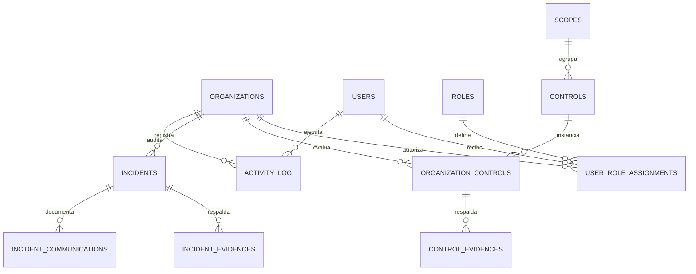

# Modelo lógico

## Criterio de acceso

- Los roles `TIBOX_ADMIN` y `TIBOX_VIEWER` tienen alcance global.
- Los roles `CLIENT_EDITOR` y `CLIENT_VIEWER` se asignan por empresa.
- Una persona puede tener permisos diferentes en empresas distintas.
- La API debe resolver las empresas autorizadas desde `security.UserRoleAssignments` en cada solicitud.
